# EfficientAD
Unofficial implementation of paper https://arxiv.org/abs/2303.14535

[](https://paperswithcode.com/sota/anomaly-detection-on-mvtec-loco-ad?p=efficientad-accurate-visual-anomaly-detection)

Huge thanks to the authors of both the paper and the unofficial implementation. This is a forked version with some modification for custom datasetsee. See here for the original unofficial implementation: https://github.com/nelson1425/EfficientAD.git

## Quick Start:

Prepare dataset:
```bash
cd dataset
python prepare_dataset.py --annotations original/annotations/instance.json --labeled_dir original/images/ --unlabeled_dir original/normal/B/ --output_dir leddd --train_ratio 0.8
```

Train EfficientAD on custom dataset:
```bash
python train.py --dataset custom --custom_dataset_path dataset/leddd --output_dir output/1 --model_size small --epochs 3 --batch_size 10
```

Evaluate EfficientAD on custom dataset:
```bash
python eval.py --dataset custom --custom_dataset_path dataset/leddd --output_dir output/1 --model_size small --map_format jpg --threshold 25 --weights_dir output/1/trainings/custom
```

### Expected Output

(PLEASE SEE [It Even Finds Many Mislabeled Samples](#it-even-finds-many-mislabeled-samples) FOR THE LOW ACCURACY OF `good` CLASS)

```bash

Following shows the metrics under different `threshold` values:

```bash
(effad) ee303@ee303-Z790-AORUS-ELITE:~/Documents/agbld/GitHub/EfficientAD$ python efficientad.py --dataset custom --custom_dataset_path dataset/leddd --output_dir output/1 --model_size small --map_format jpg --train_steps 1000 --threshold 20 --batch_size 4
Computing mean of features: 100%|██████████████████████████████████████████████████████████████████| 190/190 [00:01<00:00, 105.77it/s]
Computing std of features: 100%|███████████████████████████████████████████████████████████████████| 190/190 [00:01<00:00, 167.34it/s]
Current loss: 4.9925  : 100%|█████████████████████████████████████████████████████████████████████| 1000/1000 [00:52<00:00, 18.92it/s]
Final map normalization: 100%|████████████████████████████████████████████████████████████████████████| 22/22 [00:00<00:00, 48.38it/s]
Final inference: 100%|█████████████████████████████████████████████████████████████████████████████| 561/561 [00:05<00:00, 107.96it/s]

Class            Accuracy    Precision    Recall    Num Samples
-------------  ----------  -----------  --------  -------------
defect_type_2      0.9107       1.0000    0.9107            112
defect_type_3      0.9770       1.0000    0.9770             87
defect_type_4      1.0000       1.0000    1.0000            134
defect_type_6      1.0000       1.0000    1.0000              6
defect_type_7      1.0000       1.0000    1.0000             10
good               0.8538       0.0000  nan                 212

Class      Accuracy    Precision    Recall    Num Samples
-------  ----------  -----------  --------  -------------
Overall      0.9234       0.9158    0.9656            561
Final image auc: 97.6807
```

```bash
(effad) ee303@ee303-Z790-AORUS-ELITE:~/Documents/agbld/GitHub/EfficientAD$ python efficientad.py --dataset custom --custom_dataset_path dataset/leddd --output_dir output/1 --model_size small --map_format jpg --train_steps 1000 --threshold 15 --batch_size 4
Computing mean of features: 100%|██████████████████████████████████████████████████████████████████| 190/190 [00:01<00:00, 104.68it/s]
Computing std of features: 100%|███████████████████████████████████████████████████████████████████| 190/190 [00:01<00:00, 166.85it/s]
Current loss: 5.0027  : 100%|█████████████████████████████████████████████████████████████████████| 1000/1000 [00:52<00:00, 19.02it/s]
Final map normalization: 100%|████████████████████████████████████████████████████████████████████████| 22/22 [00:00<00:00, 73.24it/s]
Final inference: 100%|█████████████████████████████████████████████████████████████████████████████| 561/561 [00:05<00:00, 104.84it/s]

Class            Accuracy    Precision    Recall    Num Samples
-------------  ----------  -----------  --------  -------------
defect_type_2      0.9911       1.0000    0.9911            112
defect_type_3      1.0000       1.0000    1.0000             87
defect_type_4      1.0000       1.0000    1.0000            134
defect_type_6      1.0000       1.0000    1.0000              6
defect_type_7      1.0000       1.0000    1.0000             10
good               0.8160       0.0000  nan                 212

Class      Accuracy    Precision    Recall    Num Samples
-------  ----------  -----------  --------  -------------
Overall      0.9287       0.8992    0.9971            561
Final image auc: 97.5739
```

## Case Study

Please note that this is a fully UNSUPERVISED learning approach, requiring NO ANNOTATIONS. In the current setting, the model is trained with only HALF of the normal samples and can be trained in UNDER 2 MINUTES on an RTX 4090.

### Good Samples (Normal)

<table>
    <tr>
        <td>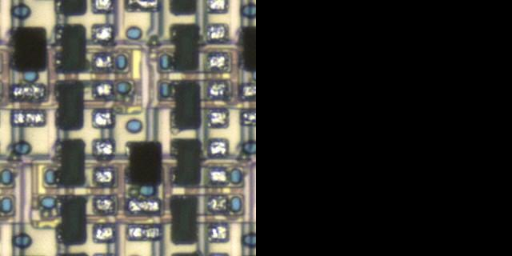<br /><center>Good 1</center></td>
        <td>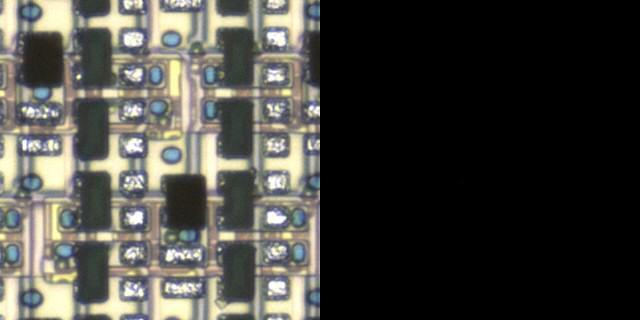<br /><center>Good 2</center></td>
        <td>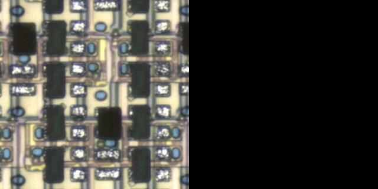<br /><center>Good 3</center></td>
    </tr>
</table>

### Defect Samples (Anomalies)

<table>
    <tr>
        <td>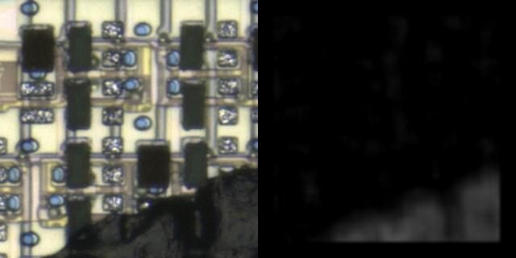<br /><center>Particle Big 1</center></td>
        <td>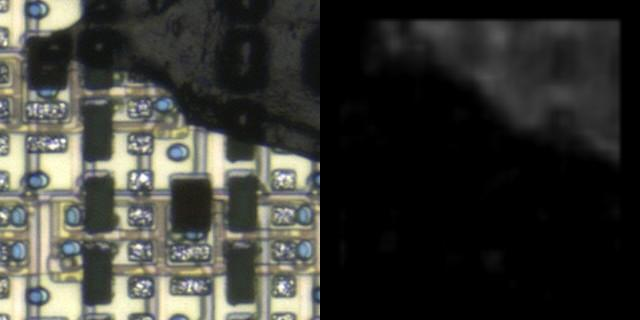<br /><center>Particle Big 2</center></td>
    </tr>
</table>
<table>
    <tr>
        <td>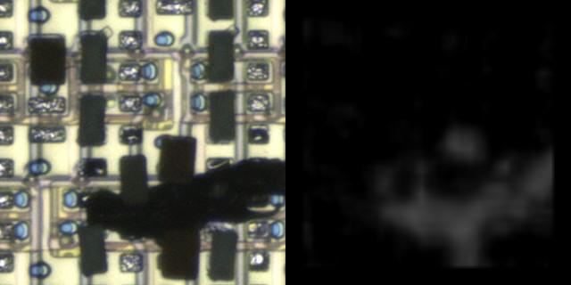<br /><center>Particle 1</center></td>
        <td>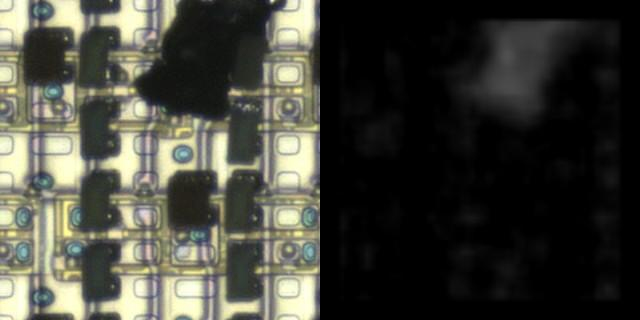<br /><center>Particle 2</center></td>
    </tr>
</table>
<table>
    <tr>
        <td>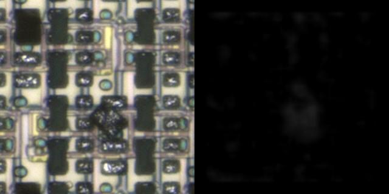<br /><center>LED NG 1</center></td>
        <td>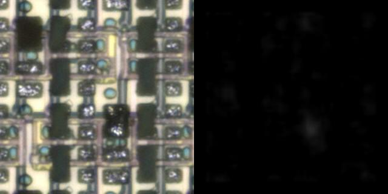<br /><center>LED NG 2</center></td>
    </tr>
</table>
<table>
    <td>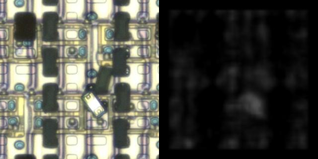<br /><center>Flip 1</center></td>
    <td>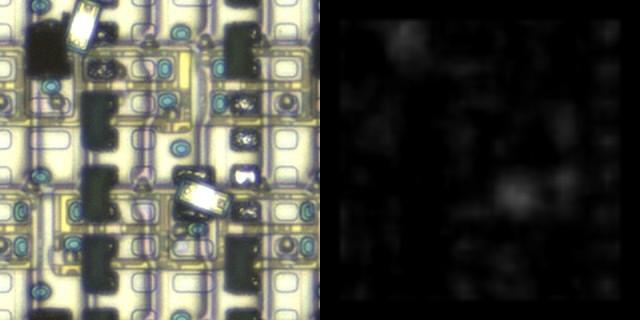<br /><center>Flip 2</center></td>
    <td>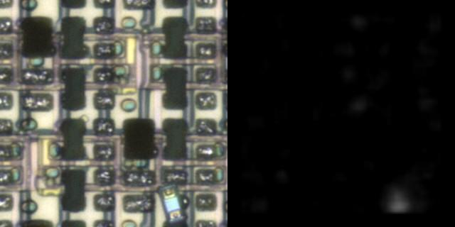<br /><center>Flip 3</center></td>
    </tr>
</table>
<table>
    <td>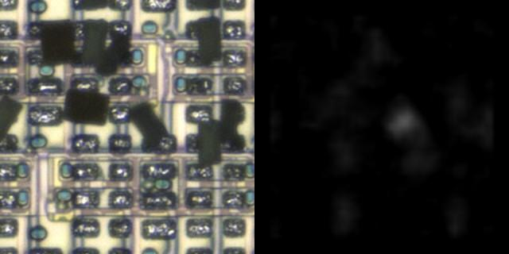<br /><center>Tilt 1</center></td>
    <td>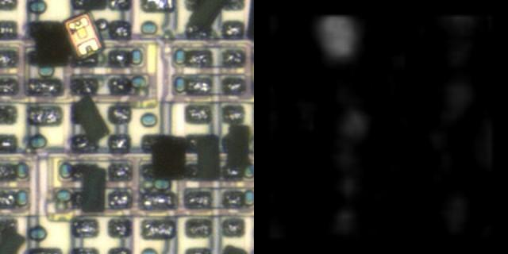<br /><center>Tilt 2</center></td>
    <td>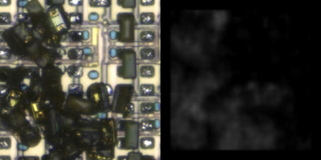<br /><center>...</center></td>
    </tr>
</table>

### It Even Finds Many Mislabeled Samples

There're MUCH MORE mislabeled samples in the dataset. I just show a few of them here.

<table>
    <tr>
        <td>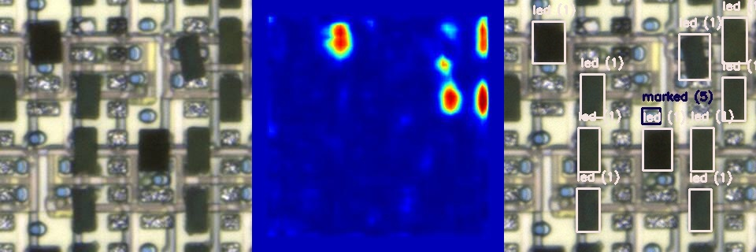<br /><center>Mislabeled 1</center></td>
        <td>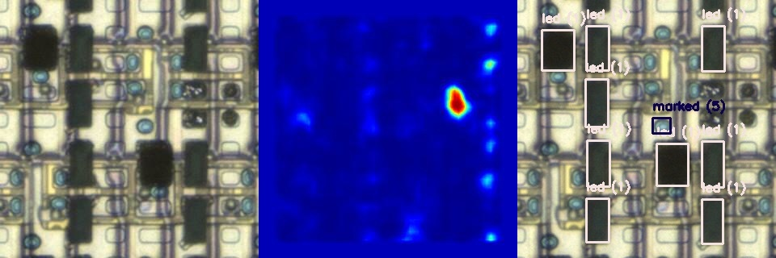<br /><center>Mislabeled 2</center></td>
    </tr>
    <tr>
        <td>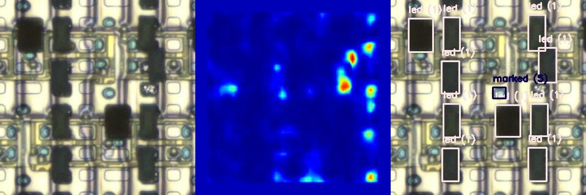<br /><center>Mislabeled 3</center></td>
        <td>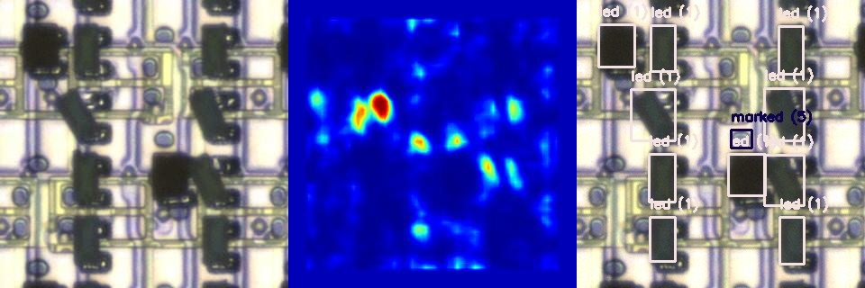<br /><center>Mislabeled 4</center></td>
    </tr>
</table>


## TODO

- [ ] Read the paper
- [ ] Understand the metrics
- [ ] Familiarize with the code
- [ ] Integrate this repo with [agbld/led-defects-detection](https://github.com/agbld/led-defects-detection.git)